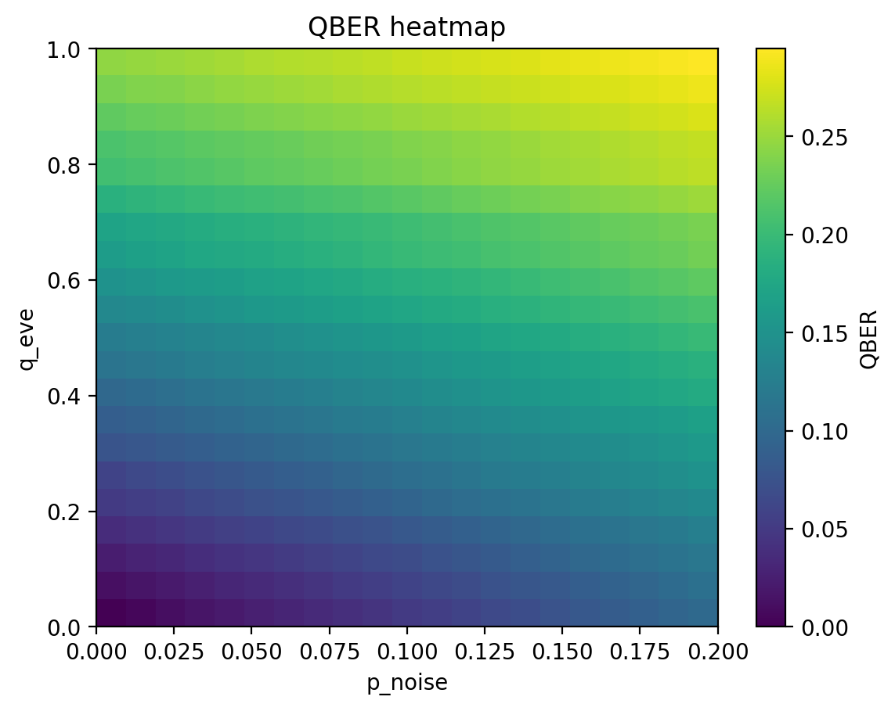
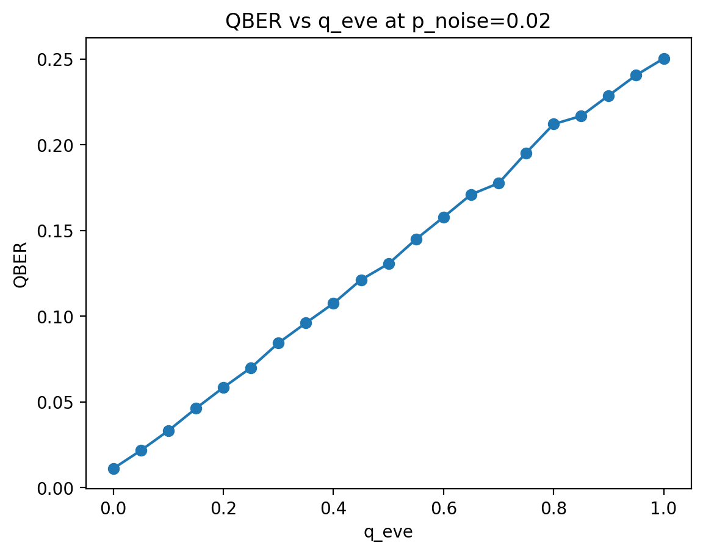
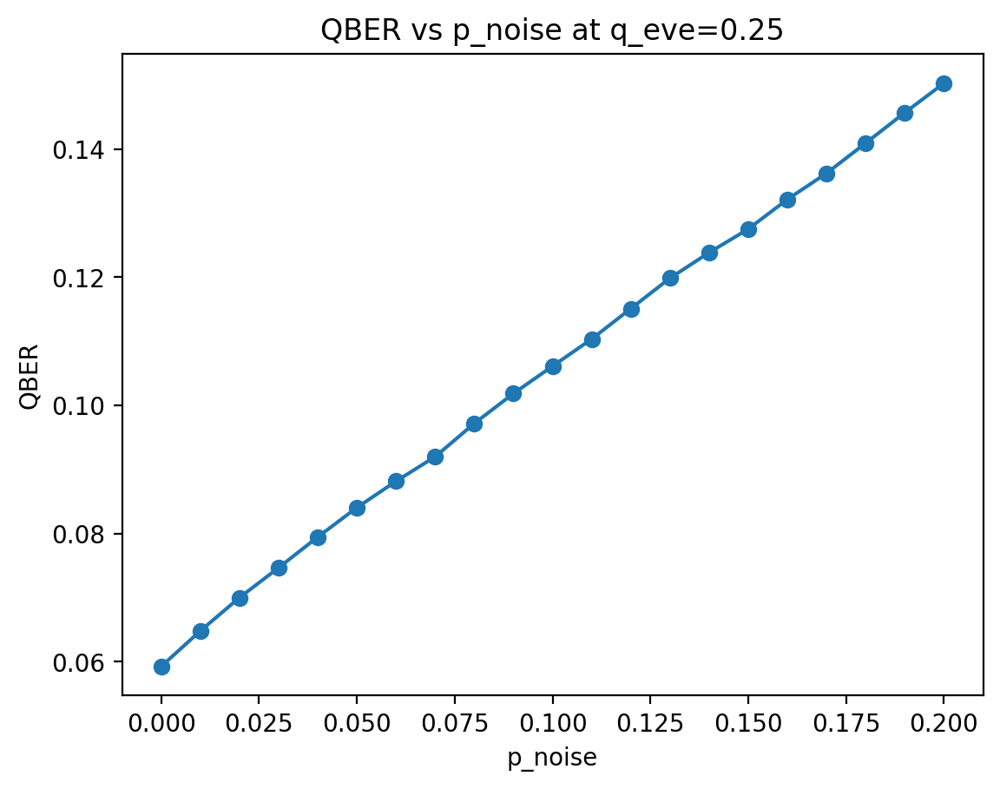

# bb84-qber-analysis

A rigorous, research-grade Monte Carlo simulation of the **BB84 Quantum Key Distribution protocol** that sweeps channel noise and eavesdropping probability across a full 2-D parameter space and compares results against the Shor–Preskill information-theoretic security bound.

---

## Table of Contents

1. [Overview](#overview)
2. [Theory](#theory)
   - [BB84 Protocol](#bb84-protocol)
   - [Noise Model](#noise-model)
   - [Intercept-Resend Attack](#intercept-resend-attack)
   - [Combined QBER Model](#combined-qber-model)
   - [Shor–Preskill Key Rate and Security Threshold](#shorpreskill-key-rate-and-security-threshold)
3. [Code Architecture](#code-architecture)
4. [Installation](#installation)
5. [Usage](#usage)
6. [Results](#results)
7. [Bug Fixes](#bug-fixes)
8. [References](#references)

---

## Overview

This project implements the BB84 quantum key distribution protocol at two levels:

- **Classical Monte Carlo layer** (`bb84_simulation.py`, `run_sweep.py`) — fast, vectorized NumPy simulation, runs 441 parameter combinations in parallel.
- **Quantum density-matrix layer** (`states.py`, `measurement.py`, `eve.py`, `noise_models.py`) — full QuTiP implementation using proper quantum states and Born-rule measurements.

The main experiment sweeps a **21 × 21 grid** of `(p_noise, q_eve)` values and compares the measured QBER against the **Shor–Preskill security threshold Q\* ≈ 11.003 %**.

**Key numerical results** (`N = 50 000` photons, `seed = 1`):

| Quantity | Value |
|---|---|
| Total sweep points | 441 (21 × 21) |
| Photons per simulation | 50 000 |
| Sifted bits per simulation | 25 051 (≈ 50.10 %) |
| Security threshold Q\* | 11.003 % |
| Secure grid points | 121 / 441 (27.4 %) |
| QBER range | 0.000 % – 29.48 % |
| Monte Carlo std. error on QBER | ≈ 0.20 % |

---

## Theory

### BB84 Protocol

BB84 (Bennett & Brassard, 1984) is the first and most widely studied QKD protocol. It encodes information in single photon polarisation states drawn from two **mutually unbiased bases**:

| Basis | Symbol | Bit 0 | Bit 1 |
|---|---|---|---|
| Rectilinear | + | \|0⟩ | \|1⟩ |
| Diagonal | × | \|+⟩ = (\|0⟩+\|1⟩)/√2 | \|−⟩ = (\|0⟩−\|1⟩)/√2 |

**Protocol execution:**

1. **Preparation** — Alice picks a random bit $b \in \{0,1\}$ and a random basis $\beta \in \{+, \times\}$, prepares $|\psi_{b,\beta}\rangle$, and sends it over the quantum channel.
2. **Measurement** — Bob independently picks a random basis $\beta'$ and measures.
3. **Sifting** — Alice and Bob announce $\beta, \beta'$ over an authenticated public channel; only positions where $\beta = \beta'$ are kept (≈ 50 % of photons).
4. **Parameter estimation** — A random sample of the sifted key is publicly compared to estimate the QBER.
5. **Post-processing** — If QBER < Q\*, error correction and privacy amplification yield a provably secret key.

### Noise Model

The quantum channel is modelled as a **depolarising/randomising channel**: with probability `p_noise`, the transmitted qubit is replaced by the maximally mixed state $\rho = I/2$, regardless of what Alice sent. In the classical Monte Carlo, this is implemented by replacing the transmitted bit with a uniformly random bit (0 or 1 with equal probability).

The effective bit error rate — conditioned on Alice and Bob choosing the same basis — is:

$$\mathrm{QBER}_\mathrm{noise} = \frac{p_\mathrm{noise}}{2}$$

*Derivation:* With probability `p_noise` the bit is randomised; given that, it equals Alice's bit with probability 1/2, so the error probability is `p_noise × 1/2`.

Numerical verification from the sweep:

| `p_noise` | Measured QBER (q=0) | Theoretical p/2 | Error |
|---|---|---|---|
| 0.05 | 0.02595 | 0.02500 | 0.00095 |
| 0.10 | 0.04994 | 0.05000 | 0.00006 |
| 0.20 | 0.10075 | 0.10000 | 0.00075 |

### Intercept-Resend Attack

Eve performs a **naive intercept-resend attack**: she intercepts each photon independently with probability `q_eve`. For each intercepted photon:

1. She randomly picks a basis (rectilinear or diagonal, each with probability 1/2).
2. She measures, collapsing the quantum state.
3. She prepares a fresh photon consistent with her measurement result and forwards it to Bob.

When Eve chooses the **wrong basis** (probability 1/2), she sends an incorrect polarisation state to Bob. When Bob then measures in Alice's original basis, he obtains a random outcome, introducing an error with probability 1/2. The resulting QBER contribution:

$$\mathrm{QBER}_\mathrm{Eve} = q_\mathrm{eve} \times \frac{1}{2} \times \frac{1}{2} = \frac{q_\mathrm{eve}}{4}$$

Numerical verification (p_noise = 0):

| `q_eve` | Measured QBER | Theoretical q/4 | Error |
|---|---|---|---|
| 0.25 | 0.05924 | 0.06250 | 0.00326 |
| 0.50 | 0.12367 | 0.12500 | 0.00133 |
| 1.00 | 0.24606 | 0.25000 | 0.00394 |

### Combined QBER Model

When noise and eavesdropping act simultaneously, the exact closed-form QBER (derived by conditioning on all event combinations) is:

$$\boxed{\mathrm{QBER}(p, q) = \frac{p}{2} + \frac{q}{4}\,(1 - p)}$$

where $p = p_\mathrm{noise}$ and $q = q_\mathrm{eve}$.

For small $p \cdot q$, this reduces to the familiar linear approximation: $\mathrm{QBER} \approx p/2 + q/4$.

Representative cross-checks:

| (`p_noise`, `q_eve`) | Measured QBER | Theory | |Δ| |
|---|---|---|---|
| (0.10, 0.25) | 0.10610 | 0.10625 | 0.00015 |
| (0.20, 0.50) | 0.19895 | 0.20000 | 0.00105 |
| (0.15, 0.40) | 0.16075 | 0.16000 | 0.00075 |

### Shor–Preskill Key Rate and Security Threshold

The **asymptotic secret key rate** per sifted bit under the Shor–Preskill security proof is:

$$K(Q) = 1 - 2\,h_2(Q) \geq 0$$

where $h_2(Q) = -Q\log_2 Q - (1-Q)\log_2(1-Q)$ is the binary entropy function. A positive key rate requires:

$$Q < Q^* \quad \text{where} \quad h_2(Q^*) = \frac{1}{2}$$

Solving numerically (1 000 000-point grid): **$Q^* \approx 0.11003$ (11.003 %)**.

Key rate at selected operating points:

| QBER | Key rate K(Q) | Regime |
|---|---|---|
| 0 % | 1.000 bit/sifted bit | Perfect |
| 5 % | 0.427 bit/sifted bit | Secure |
| 8 % | 0.196 bit/sifted bit | Secure |
| 10 % | 0.062 bit/sifted bit | Marginally secure |
| 11 % | ≈ 0.000 | Threshold |
| 25 % | −0.623 | Insecure |

**Security boundary in parameter space:**

Setting $\mathrm{QBER}(p, q) = Q^*$ and solving for $q$:

$$q_\mathrm{eve}^\mathrm{boundary}(p) = \frac{4\!\left(Q^* - \dfrac{p}{2}\right)}{1 - p}$$

Comparison of the exact boundary with simulation (max secure `q_eve` in the grid):

| `p_noise` | Boundary (theory) | Max secure `q_eve` (sim.) |
|---|---|---|
| 0.00 | 0.440 | 0.40 |
| 0.05 | 0.358 | 0.35 |
| 0.10 | 0.267 | 0.25 |
| 0.15 | 0.165 | 0.15 |
| 0.20 | 0.050 | 0.05 |

The simulation matches the theoretical boundary to within one grid step (Δq = 0.05) in every case, validating both the implementation and the analytical formula.

---

## Code Architecture

```
bb84-qber-analysis/
├── src/
│   ├── bb84_simulation.py   # Core Monte Carlo engine
│   ├── run_sweep.py         # Parallel 2-D parameter sweep → CSV
│   ├── visualize.py         # Heatmap + 1-D slice plots
│   │
│   ├── states.py            # QuTiP: BB84 quantum states & projectors
│   ├── measurement.py       # QuTiP: Born-rule projective measurement
│   ├── eve.py               # QuTiP: intercept-resend attack (density matrices)
│   ├── noise_models.py      # QuTiP: depolarising channel
│   └── qber_analysis.py     # Sifting + QBER utilities (NumPy)
│
├── results/
│   ├── sweep_n50000_seed1.csv
│   └── plots/n50000_seed1/
│       ├── qber_heatmap.png
│       ├── qber_vs_qeve_p0.02.png
│       └── qber_vs_pnoise_q0.25.png
│
├── requirements.txt
└── README.md
```

### Module Reference

| Module | Key symbols | Description |
|---|---|---|
| `bb84_simulation.py` | `BB84Params`, `BB84Result`, `run_bb84`, `bb84_key_rate`, `compute_qber_threshold` | Single-point Monte Carlo simulation; computes sifted key and QBER |
| `run_sweep.py` | `SweepConfig`, `run_sweep_parallel`, `save_sweep_csv` | Cartesian-product sweep with `ProcessPoolExecutor` |
| `visualize.py` | `plot_qber_continuous`, `plot_security_binary`, `theoretical_boundary` | matplotlib visualisation from CSV |
| `states.py` | `BB84States`, `prepare_density_matrix` | QuTiP ket and density-matrix representations of all 4 BB84 states |
| `measurement.py` | `measure_in_basis` | Born-rule projective measurement on a `Qobj` |
| `eve.py` | `intercept_resend` | Full quantum Eve: measures in random basis, re-prepares state |
| `noise_models.py` | `apply_depolarizing_channel` | Replaces qubit with I/2 with probability `p_noise` |
| `qber_analysis.py` | `sift_keys`, `qber`, `count_errors` | Basis sifting and QBER computation utilities |

---

## Installation

```bash
git clone https://github.com/ziyadbagh/bb84-qber-analysis.git
cd bb84-qber-analysis
pip install -r requirements.txt
```

Requirements: Python ≥ 3.11, NumPy ≥ 1.24, pandas ≥ 2.0, matplotlib ≥ 3.7, QuTiP ≥ 4.7.

---

## Usage

### Single simulation

```bash
python -m src.bb84_simulation
```

Example output (`p_noise = 0.02`, `q_eve = 0.20`):
```
=== BB84 Monte Carlo Simulation ===
Total photons:     50000
Sifted key size:   25019
Errors observed:   1465
Observed QBER:     0.0585 (5.85%)

=== Security Threshold (Shor-Preskill) ===
Maximum QBER:      0.1100 (11.00%)

✔ Secure regime: secret key extraction is possible.
```

### Full parameter sweep

```bash
cd src
python run_sweep.py
```

Produces `results/bb84_qber_sweep.csv`. On a typical 8-core machine, the 441-point sweep completes in under 60 seconds.

### Visualisation

```bash
cd src
python visualize.py
```

Opens two matplotlib windows: the QBER heatmap (continuous colour scale) and the binary SECURE/ABORT decision map, both overlaid with the exact theoretical security boundary.

---

## Results

### QBER Heatmap



QBER varies from 0 % (bottom-left corner: no noise, no Eve) to ≈ 29.5 % (top-right: maximum noise and full interception). The colour gradient is dominated by `q_eve` (vertical axis) because a fully intercepting Eve contributes QBER → 25 %, while maximum channel noise (`p_noise = 0.20`) contributes only QBER = 10 %. The near-vertical iso-QBER contours reflect the factor-of-2 difference in the contributions (q/4 vs. p/2).

### QBER vs. Eavesdropping Probability



At `p_noise = 0.02`, QBER grows linearly from ≈ 1.0 % (zero eavesdropping) to ≈ 25 % (100 % interception) with slope ≈ 0.245 ≈ (1 − p)/4 = 0.98/4. The linear relationship confirms the analytical formula.

### QBER vs. Channel Noise



At `q_eve = 0.25`, QBER starts at ≈ 5.9 % (from Eve alone) and increases with slope ≈ 0.38 ≈ 1/2 − q/4. The linear regime holds across the full noise range tested.

---

## Bug Fixes

### 1. Missing `import numpy as np` in `noise_models.py`

The module used `np.random.Generator` as a type hint without importing NumPy, causing `NameError` on import. **Fixed** by adding `import numpy as np` at the top.

### 2. Incorrect theoretical boundary formula in `visualize.py`

The original formula was:

```python
# WRONG — assumes QBER = p_noise + q_eve/4
return 4.0 * (QBER_THRESHOLD - p_vals)
```

Because the depolarising channel gives effective error rate `p_noise/2` (not `p_noise`), the correct formula is:

```python
# CORRECT — derived from QBER = p/2 + (q/4)(1-p) = Q*
return 4.0 * (QBER_THRESHOLD - p_vals / 2.0) / (1.0 - p_vals)
```

The old formula produced **negative boundary values** for `p_noise ≥ 0.11` (e.g., `q_eve = −0.16` at `p_noise = 0.15`), which is physically impossible. The corrected formula gives `q_eve = 0.165` at `p_noise = 0.15`, in agreement with the simulation data.

---

## References

1. Bennett, C. H. & Brassard, G. (1984). *Quantum cryptography: Public key distribution and coin tossing.* Proc. IEEE Int. Conf. Computers, Systems and Signal Processing, 175–179.

2. Shor, P. W. & Preskill, J. (2000). *Simple proof of security of the BB84 quantum key distribution protocol.* Physical Review Letters **85**(2), 441–444.

3. Nielsen, M. A. & Chuang, I. L. (2010). *Quantum Computation and Quantum Information* (10th Anniversary Ed.). Cambridge University Press.

4. Gisin, N., Ribordy, G., Tittel, W. & Zbinden, H. (2002). *Quantum cryptography.* Reviews of Modern Physics **74**(1), 145–195.

5. Scarani, V. et al. (2009). *The security of practical quantum key distribution.* Reviews of Modern Physics **81**(3), 1301–1350.
